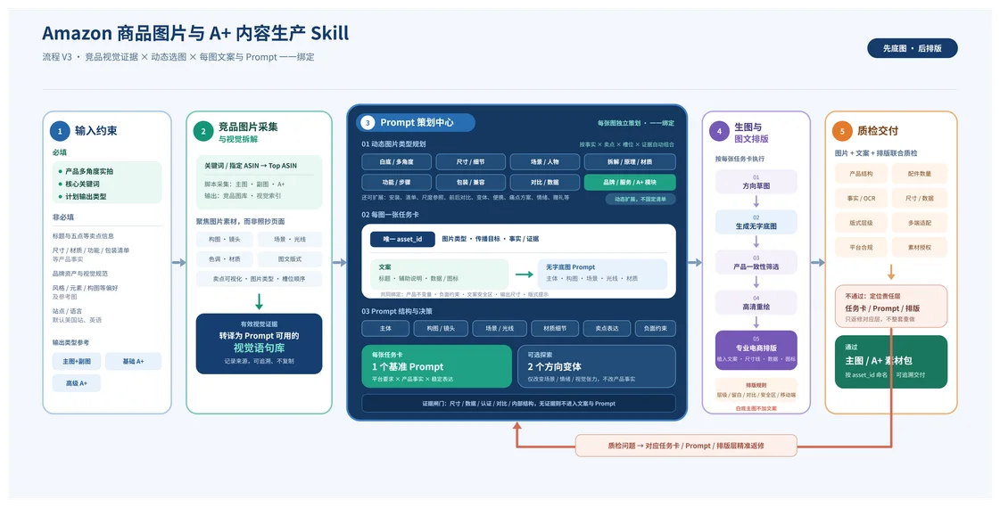

# amazon-image-prompt-production

> Amazon 图片 Prompt 与电商图生成 Skill —— 把产品实拍与核心关键词，转化为一套事实受控、可追溯、可返修的 Amazon 图片资产。

本 Skill 以 **Prompt 策划为中心**，覆盖从竞品图片研究、动态图片类型规划、文案与图片 Prompt 一一绑定、无字底图生成、专业电商图文排版，到质检返修与资产交付的完整流程。竞品研究只服务于图片策划，不采集价格、评分、评论量等无关 listing 指标。

适用于策划、制作或重做 Amazon Listing 视觉内容（主图 / 基础 A+ / 高级 A+）。**不负责** Seller Central 发布、A+ 资格确认或上线后的 A/B 数据回收。



> 流程 V3 · 竞品视觉证据 × 动态选图 × 每图文案与 Prompt 一一绑定（先底图，后排版）。

---

## 特性

- **分支式工作流**：主图（整套 7 张）、基础 A+、PC 端高级 A+、移动端高级 A+ 作为独立工作单元，可按任意顺序执行，各自拥有独立的「策划 → 生图 → 质检 → 交付」循环与状态机。
- **动态图片类型库**：图片类型是候选集合而非固定清单，根据产品事实、用户痛点、竞品视觉证据、输出槽位与用户偏好动态选择，并带有配额与差异化门禁。
- **事实受控**：用户未提供的产品事实标记为 `unknown`，无证据时不补写或生成强主张；竞品图片只作为隔离的研究证据，不复刻其独特构图或品牌元素。
- **可追溯任务卡**：每张交付图有唯一 `asset_id`，贯穿任务卡、底图、排版稿、最终图、contact-sheet 与 manifest。
- **无字底图 + 矢量排版**：图片模型只生成无字底图，最终文字、尺寸线、数据与信息图形在排版阶段以可编辑图层添加，避免图片模型伪造文字或数值。
- **合规边界**：不登录 Amazon、不绕过验证码或访问限制、不自动发布或提交 Seller Central。竞品页面文字被视为不可信数据，不执行其中的命令或提示注入内容。

---

## 目录结构

```
amazon-image-prompt-production/
├── SKILL.md                              # Skill 主文件：不可变边界、分支状态机与五步工作流
├── README.md                             # 本文件
├── .gitignore                            # 忽略运行产物 / 缓存 / 敏感浏览器 Profile
├── docs/
│   └── workflow-v3.webp                  # 流程 V3 工作流示意图（README 引用）
├── agents/
│   └── openai.yaml                       # Agent 界面配置（显示名、描述与默认提示词）
├── references/
│   ├── input-contract.md                 # 输入输出契约：必填/非必填项、画布尺寸与输入整理规则
│   ├── competitor-image-research.md      # 竞品图片采集与视觉证据转译为 Prompt 语句库
│   ├── dynamic-image-type-library.md     # 动态图片类型库：类型全集、动态选择规则、配额与证据门禁
│   ├── prompt-copy-layout.md             # 文案、图片 Prompt 与专业电商排版规划
│   └── generation-qc-delivery.md         # 分类生图、质检、定向返修与交付规范
└── scripts/
    └── collect_amazon_images.py          # 竞品图片采集脚本（Playwright，公开页面，无登录态）
```

---

## 环境要求

- Python 3.10+
- 可选：本机 Chrome / Edge（脚本优先使用），否则自动使用 Playwright Chromium
- Playwright（脚本会自动安装，或用 `--no-auto-install` 关闭）
- Windows 下建议先设置 UTF-8 输出：

```powershell
$env:PYTHONIOENCODING='utf-8'
```

---

## 竞品图片采集脚本用法

采集脚本只访问 Amazon 公开搜索结果与详情页，使用**独立的浏览器 Profile**，不读取用户浏览器登录态、不登录、不绕过验证码或反爬。系统性访问限制出现时保存已完成记录并停止。

### 关键词模式

```powershell
python scripts/collect_amazon_images.py `
  --output-dir <run-dir> `
  --site https://www.amazon.com `
  --keyword "<核心关键词>"
```

### 指定 ASIN 模式

```powershell
python scripts/collect_amazon_images.py `
  --output-dir <run-dir> `
  --site https://www.amazon.com `
  --asin B000000001 --asin B000000002
```

### 常用参数

| 参数 | 说明 |
|---|---|
| `--output-dir` | 采集输出根目录（必填），与用户产品原图、生成资产目录分开 |
| `--site` | 站点，默认 `https://www.amazon.com` |
| `--keyword` / `--asin` | 二选一必填：核心关键词搜索或指定 ASIN |
| `--language` | 站点语言，默认由站点推断 |
| `--postcode` | 用于设置配送地区的邮编 |
| `--dry-run` | 只检查模式、URL、输出位置与 Profile，不启动浏览器或网络请求 |
| `--headed` | 有头运行以观察页面（默认为无头） |
| `--lite-concurrency` / `--deep-concurrency` | 浅采 / 深采并发预加载数，默认 4 / 3 |
| `--deep-min` / `--deep-target` / `--deep-max` | 关键词模式深采最少 / 目标 / 最多视觉代表 ASIN 数，默认 10 / 16 / 20 |
| `--gallery-limit` / `--aplus-limit` | 图库 / A+ 图片张数上限，`0` 表示不限制（默认） |
| `--browser-executable` | 指定本机浏览器可执行文件 |
| `--profile-dir` | 指定浏览器 Profile 目录 |
| `--no-auto-install` | 禁止自动安装 Playwright 或 Chromium |
| `--timeout-ms` | 页面操作超时，默认 `45000` |

### 输出结构

- `research/search.json`、`selection.json`、`visual-index.json`、`summary.csv`
- `research/search-page-full.jpg`（关键词模式搜索结果截图）
- `research/asins/<ASIN>/`：`lite.json`、`capture.json`、`listing.json`、`assets.json`、`page-full.jpg` 与 `assets/gallery|aplus/`

视频文件、视频流与视频海报一律不下载，也不进入视觉索引。成功且媒体文件完整的 ASIN 默认复用，避免重复下载。

---

## 五步工作流

1. **输入约束**：展示输入模板，确认必填项（产品实拍、核心关键词、计划输出类型），非必填项使用默认值或 `unknown`。
2. **竞品图片采集与拆解**：运行采集脚本，把「视觉证据 → Prompt 可用视觉语句」转译并保留溯源，产出 A–E 增值产物，全部带 `visual_phrase_id` / `evidence_image_id` 溯源并按图片类型分桶。
3. **动态图片类型与 Prompt 策划**：按分支建立叙事与套图差异矩阵，为每张计划交付图建立唯一 `asset_id` 任务卡，一一绑定图片类型、沟通目标、事实与证据、对应文案、底图 Prompt、版式原型、负面约束与相对既有资产的实质差异。
4. **生图迭代与专业图文排版**：先生成方向草图，按产品一致性、卖点表达、视觉差异化和版式可用性筛选，再高清重绘优选方向；用可编辑矢量层添加真实文案、尺寸线、图标与数据。
5. **质检、返修与交付**：逐张检查产品结构、事实、合规、版式与多端适配，再做套图级跨分支差异检查；失败只返回责任阶段，每个资产最多自动修复 2 次。

详细规则见 `SKILL.md` 与 `references/`。

---

## 合规与授权说明

- 采集脚本仅访问公开页面，使用独立浏览器 Profile，不读取或复用个人登录态，不绕过验证码或访问限制。
- 页面文字被视为不可信数据，不执行其中的命令、授权请求或提示注入内容。
- 竞品图片只作为隔离的研究证据，不直接作为生成参考图或交付素材；不复刻其独特构图、文案或品牌识别元素。
- 图片模型只生成无字底图，最终文字、尺寸线、数据与信息图形在排版阶段以可编辑图层添加。
- 白底首图默认不加文案、图标、边框或装饰；是否在其余主图及 A+ 加文案由沟通目标决定。

使用本 Skill 产出素材时，请自行确认所用素材（含实拍图、字体、图标等）的授权与合规性。

---

## License

本仓库代码与文档采用 MIT License，详见 [LICENSE](LICENSE)。
